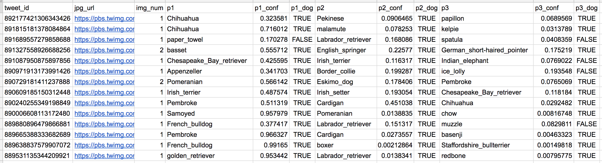

## Introduction
- This project utilizes `pandas` to wrangle (and analyze and visualize) the tweet archive of Twitter user [@dog_rates](https://twitter.com/dog_rates), also known as [WeRateDogs](https://en.wikipedia.org/wiki/WeRateDogs)

## Data
__1. Enhanced twitter archive__
- The WeRateDogs Twitter archive dataset named `twitter-archive-enchanced.csv`
- One column the archive does contain is each tweet's text, which was used to extract rating, dog name, and dog "stage" (i.e. doggo, floofer, pupper, and puppo) to make this Twitter archive "enhanced.

__2. Additional data via the Twitter API__
- `Retweet_count` and `favourite_count` are two of the notable column ommisions
- Using the tweet IDs in the WeRateDogs Twitter archive, query the Twitter API for each tweet's JSON data using Python's Tweepy library and store each tweet's entire set of JSON data in a file called `tweet_json.txt` file.

__3. image predictions file__
- Every image in the WeRateDogs twitter archive was run through a [neural network](https://www.youtube.com/watch?v=2-Ol7ZB0MmU) that can classify breeds of dogs. The results: a table full of image predictions (the top three only) alongside each tweet ID, image URL, and the image number that corresponded to the most confident prediction (numbered 1 to 4 since tweets can have up to four images).
- The file (image_predictions.tsv) is present in each tweet according to a neural network. It should be downloaded programmatically using the Requests library and the following URL: https://d17h27t6h515a5.cloudfront.net/topher/2017/August/599fd2ad_image-predictions/image-predictions.tsv

- So for the last row in that table:
* tweet_id is the last part of the tweet URL after "status/" → https://twitter.com/dog_rates/status/889531135344209921
* p1 is the algorithm's #1 prediction for the image in the tweet → __golden retriever__
* p1_conf is how confident the algorithm is in its #1 prediction → __95%__
* p1_dog is whether or not the #1 prediction is a breed of dog → __TRUE__
* p2 is the algorithm's second most likely prediction → __Labrador retriever__
* p2_conf is how confident the algorithm is in its #2 prediction → __1%__
* p2_dog is whether or not the #2 prediction is a breed of dog → __TRUE__